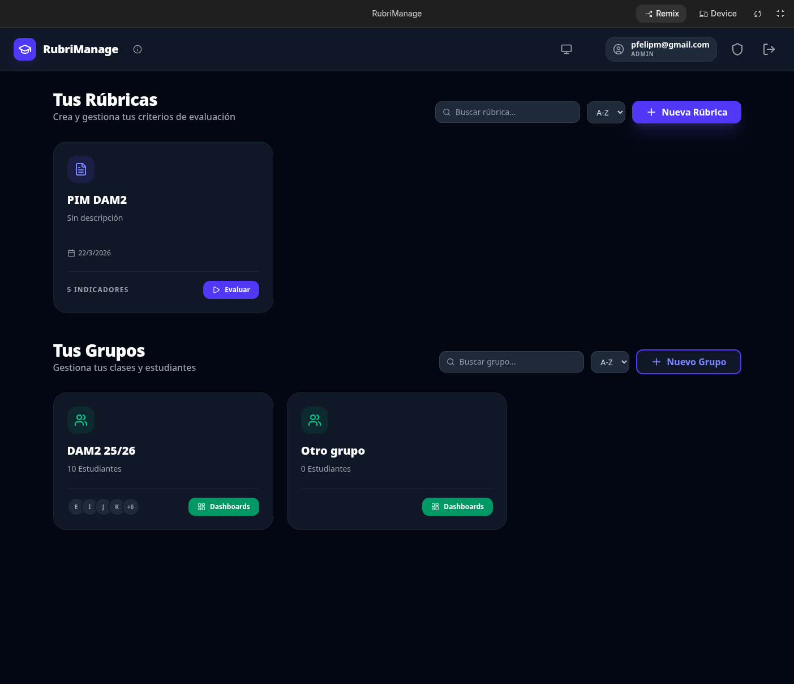
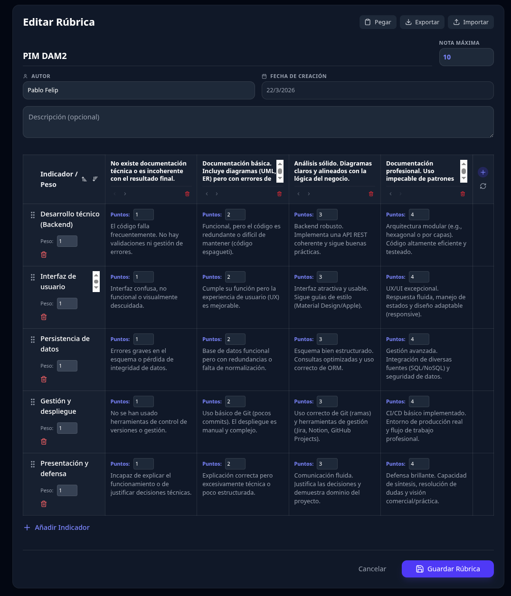
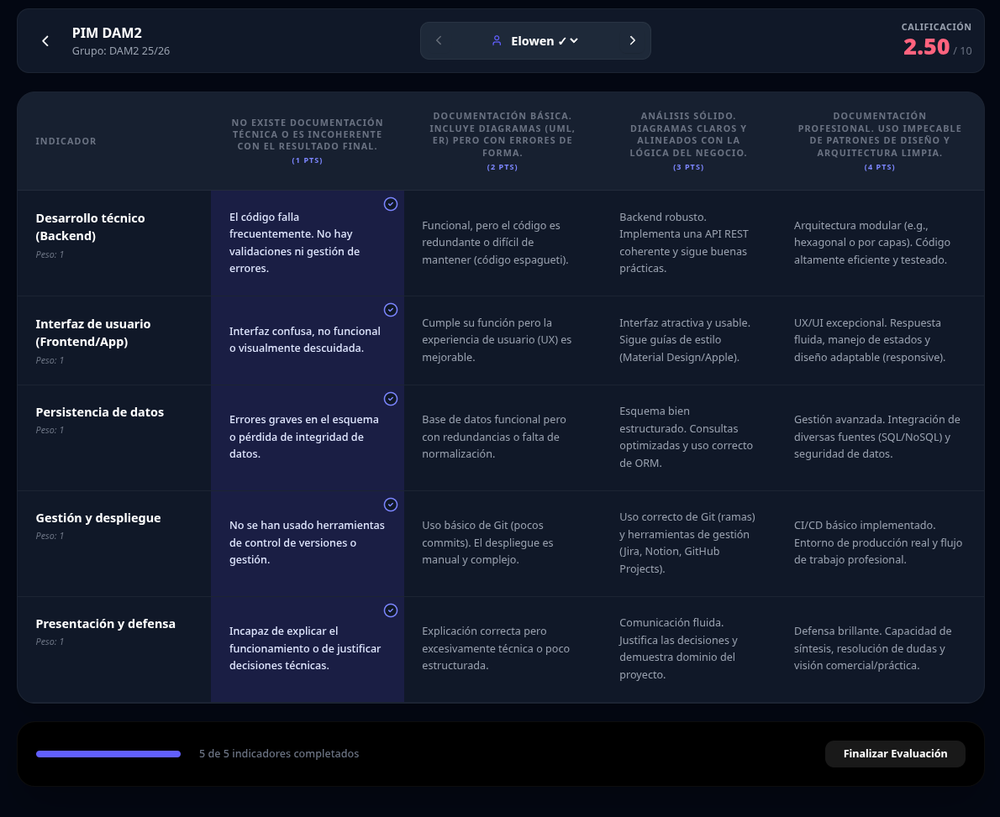
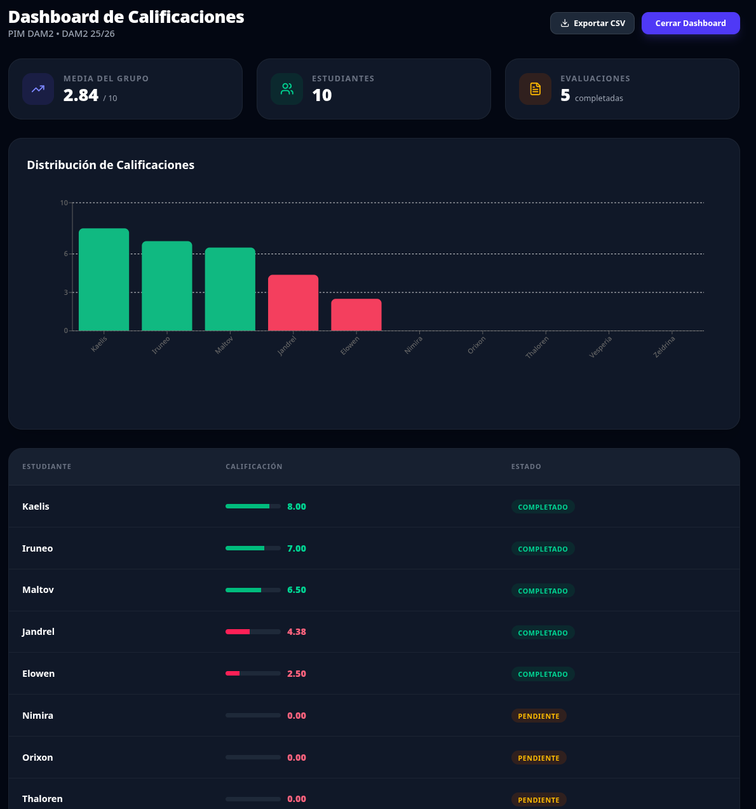
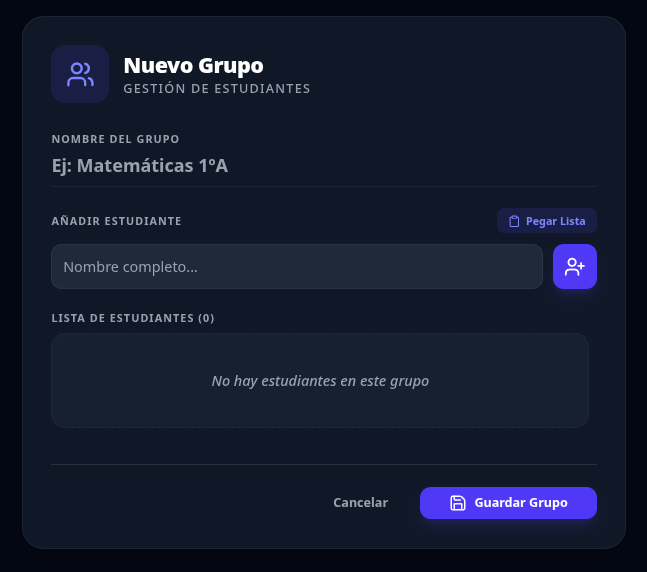
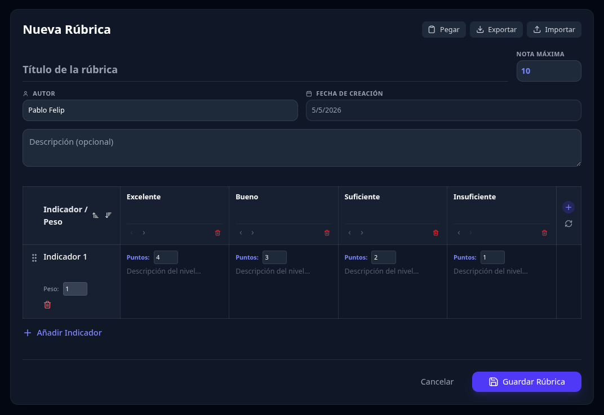
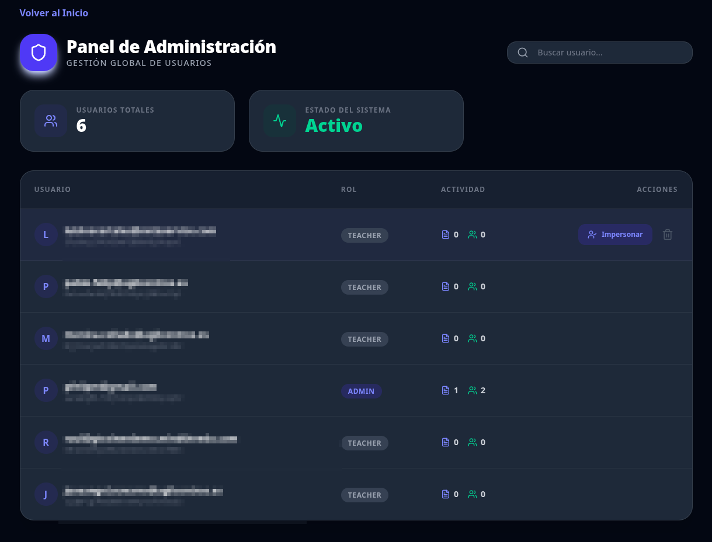

<div align="center">

</div>

# 🎓 RubriManage
### Explorando el vibe-coding full-stack con Google AI Studio

**RubriManage** es un prototipo funcional de una herramienta de gestión de rúbricas y evaluación docente, diseñada para simplificar el flujo de trabajo en el aula. Este proyecto no es un producto comercial, sino un **experimento educativo y técnico** para explorar las capacidades de la nueva era de desarrollo de Google.

---

## 🚀 Acceso y remix en AI Studio

La aplicación ha sido desarrollada íntegramente utilizando las capacidades full-stack de **Google AI Studio**. No se ha realizado un despliegue en producción (por costes de infraestructura), pero puedes probarla, inspeccionar su código y "remixearla" directamente aquí:

👉 **[Abrir RubriManage en AI Studio](https://ai.studio/apps/5e26f1b7-3b59-4923-93f9-97710886c4a4)**

---

## 📅 El contexto: la era del "vibe-coding" (marzo 2026)

Este proyecto nace aprovechando el revolucionario anuncio de Google en marzo de 2026: 
🔗 **[Full-stack vibe-coding in Google AI Studio](https://blog.google/innovation-and-ai/technology/developers-tools/full-stack-vibe-coding-google-ai-studio)**

Esta actualización permite a AI Studio configurar automáticamente un backend completo en **Firebase**, gestionando de forma transparente:
- Autenticación con Google.
- Reglas de seguridad de Firestore basadas en lenguaje natural.
- Definición semántica de datos mediante blueprints.
- Gestión de claves de API y entornos de ejecución.

Este movimiento coincide con el anuncio del fin de ciclo de **Firebase Studio**, señalando a AI Studio como el nuevo "flagship" de Google para una experiencia de desarrollo asistida por IA donde la barrera entre la idea y la ejecución desaparece.

---

## ✨ Capacidades funcionales

- **Gestión de rúbricas:** creación, edición y duplicación de rúbricas con indicadores ponderados y niveles de logro personalizados.
- **Importación inteligente:** pegado directo de tablas desde Word o Google Docs para generar rúbricas instantáneamente.
- **Evaluador ágil:** interfaz optimizada con atajos de teclado para evaluar estudiantes en segundos.
- **Dashboard de analíticas:** visualización de la media del grupo y distribución de notas mediante gráficos interactivos.
- **Portabilidad:** exportación de datos en formatos JSON (rúbricas) y CSV (calificaciones).

---

## 📸 Galería de capturas

<div align="center">
  <p><strong>Vista principal y gestión de rúbricas</strong></p>
  
  <br><br>
  <p><strong>Editor avanzado de indicadores y niveles</strong></p>
  
  <br><br>
  <p><strong>Importación inteligente mediante pegado de tablas</strong></p>
  
  <br><br>
  <p><strong>Interfaz de evaluación ágil</strong></p>
  
  <br><br>
  <p><strong>Seguimiento del progreso por estudiante</strong></p>
  
  <br><br>
  <p><strong>Panel de analíticas y distribución de notas</strong></p>
  
  <br><br>
  <p><strong>Administración y gestión de usuarios</strong></p>
  
  <br><br>
  <p><strong>Soporte nativo para modo oscuro</strong></p>
  
</div>

---

## 👥 Capacidades multiusuario

RubriManage está diseñada desde cero para soportar un entorno colaborativo y jerárquico:

- **Aislamiento de espacios de trabajo:** cada profesor dispone de su propio entorno privado. Las rúbricas, grupos y evaluaciones están vinculados de forma segura a su identidad de Google mediante reglas de seguridad de Firestore (`ownerId`).
- **Sistema de roles:** diferenciación clara entre el rol de **docente** (gestión de sus propios datos) y el de **administrador** (gestión global).
- **Panel de administración:** los administradores pueden supervisar la actividad de la plataforma y gestionar los perfiles de usuario.
- **Función de impersonación:** herramienta avanzada para que los administradores puedan acceder temporalmente a la vista de un docente para labores de soporte técnico o auditoría.

---

## 🛠️ Arquitectura técnica

- **Frontend:** React 19 + Vite + TypeScript.
- **Estilos:** Tailwind CSS 4 (diseño moderno y soporte nativo de modo oscuro).
- **Backend:** Firebase (Firestore + Auth) configurado automáticamente por AI Studio.
- **Componentes:** Lucide React (iconos), Framer Motion (animaciones), Recharts (gráficos), dnd-kit (drag & drop).

---

## 🛡️ Privacidad y transparencia

**Aviso importante para usuarios:**
Al tratarse de una aplicación de demostración alojada en un entorno de "applet" de AI Studio:
1. **Almacenamiento:** toda la información que introduzcas (grupos, estudiantes, evaluaciones) se guarda en un proyecto de Firebase propiedad del autor.
2. **Acceso del administrador:** la aplicación incluye un panel de administración que permite al autor visualizar la lista de usuarios y, mediante una funcionalidad de **impersonación**, ver la aplicación exactamente como la ves tú.
3. **Uso educativo:** se recomienda no introducir datos personales reales o sensibles, ya que el propósito de este repositorio es puramente demostrativo y educativo.

---

## 💻 Exploración en local

Si deseas inspeccionar el código o ejecutar el proyecto en tu propia máquina:

1. **Clona el repositorio:**
   ```bash
   git clone https://github.com/pfelipm/RubriManage.git
   cd RubriManage
   ```
2. **Instala las dependencias:**
   ```bash
   npm install
   ```
3. **Lanza el entorno de desarrollo:**
   ```bash
   npm run dev
   ```

*Nota: la ejecución local seguirá conectada al proyecto Firebase del autor definido en `firebase-applet-config.json`.*

---

## 📄 Licencia

Este proyecto se distribuye bajo la licencia **MIT**. Siéntete libre de usarlo para aprender, mejorar tus flujos de trabajo de evaluación o como base para tus propios experimentos de vibe-coding.

---
*Creado con ❤️ por [Pablo Felip](https://github.com/pfelipm) en Google AI Studio.*
